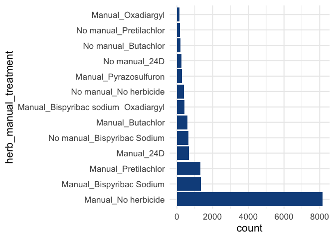
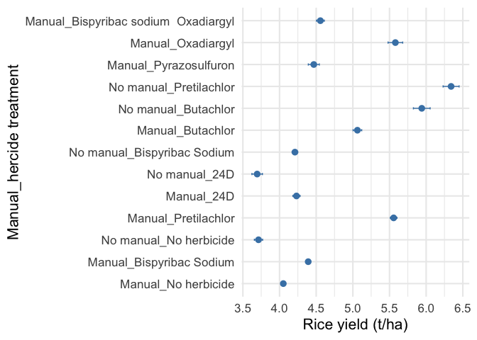
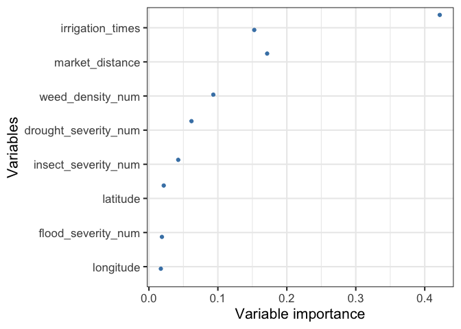
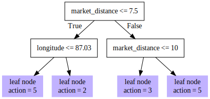
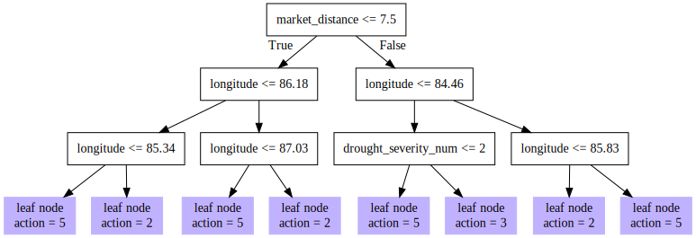
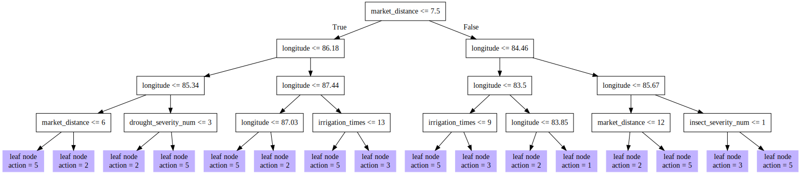

# Introduction

In this notebook, I use a causal machine learning estimator, i.e., multi-armed causal random forest with augmented inverse propensity score weights (Athey et al 2019), to estimate conditional average treatment effects (CATES) for agronomic practices. These CATEs are estimated for each individual farm thereby providing personalized estimates of the potential effectiveness of the practices.

We then use a debiased robust estimator in a policy tree optimization (Athey and Wager 2021) to generate optimal recommendations in the form of agronomic practices that maximize potential yield gains.

We use weed management as an exemplar on how to use causal random forest estimator and policy tree algorithm in generating individual specific recommendations.

# Loading dataset

We first load the data


```r
# RICE -------------------------------------------------------------------------
## Load packages ---------------------------------------------------------------
library(raster)
library(sf)
library(data.table)
library(exactextractr)
library(terra)
library(rgdal)
library(geodata)
library(ncdf4)
library(raster)
library(sf)
library(data.table)
library(exactextractr)
library(terra)
library(rgdal)
library(ggplot2)
library(geodata)
library(stars)
library(tmap)
library(tmaptools)
library(DiagrammeR)

# import data
library(rio)
Rice2018_LDS_herb=read.csv("../data/india_rice_17_18.csv")

# Clean and remove characters in herbicide name
Rice2018_LDS_herb$herbicide_name_1_revised=gsub("([^A-Za-z0-9 ])+","", Rice2018_LDS_herb$herbicide_name.1)

Rice2018_LDS_herb$herbicide_name_1_revised=as.character(Rice2018_LDS_herb$herbicide_name_1_revised)

Rice2018_LDS_herb$herbicide_name_1_revised[Rice2018_LDS_herb$herbicide_name_1_revised==""]="No herbicide"

Rice2018_LDS_herb$herbicide_name_1_revised[Rice2018_LDS_herb$herbicide_name_1_revised=="2 4D"]="24D"

table_herbicide=sort(xtabs(~Rice2018_LDS_herb$herbicide_name_1_revised))

#table_herbicide

## 
table(Rice2018_LDS_herb$herbicide_times_applied)
```

```
## 
##    0    1    2    3 
## 8512 6353  309   16
```

```r
Rice2018_LDS_herb$herbicide_times_applied_dum[Rice2018_LDS_herb$herbicide_times_applied%in%c(1,2,3)]=1

Rice2018_LDS_herb$herbicide_times_applied_dum[Rice2018_LDS_herb$herbicide_times_applied%in%c(0)]=0

table(Rice2018_LDS_herb$manual_weeding_times)
```

```
## 
##    0    1    2    3 
## 1750 9234 3833  393
```

```r
Rice2018_LDS_herb$manual_weeding_times_dum[Rice2018_LDS_herb$manual_weeding_times%in%c(1,2,3)]=1

Rice2018_LDS_herb$manual_weeding_times_dum[Rice2018_LDS_herb$manual_weeding_times%in%c(0)]=0

table(Rice2018_LDS_herb$manual_weeding_times_dum,Rice2018_LDS_herb$herbicide_times_applied_dum)
```

```
##    
##        0    1
##   0  403 1347
##   1 8109 5330
```

```r
Rice2018_LDS_herb$manual_weeding_times_dum_cat[Rice2018_LDS_herb$manual_weeding_times_dum==1]="Manual"
Rice2018_LDS_herb$manual_weeding_times_dum_cat[Rice2018_LDS_herb$manual_weeding_times_dum==0]="No manual"


Rice2018_LDS_herb=subset(Rice2018_LDS_herb,Rice2018_LDS_herb$herbicide_name_1_revised%in%c("Oxadiargyl","Pyrazosulfuron","Bispyribac sodium  Oxadiargyl","Butachlor",
                                                                                 "24D","Pretilachlor","Bispyribac Sodium","No herbicide"))


Rice2018_LDS_herb$herb_manual_treatment=paste(Rice2018_LDS_herb$manual_weeding_times_dum_cat,Rice2018_LDS_herb$herbicide_name_1_revised,sep="_")

Rice2018_LDS_herb=subset(Rice2018_LDS_herb,!(Rice2018_LDS_herb$herb_manual_treatment%in%c("NA_Bispyribac Sodium","NA_No herbicide","No manual_Bispyribac sodium  Oxadiargyl","No manual_Oxadiargyl","No manual_Pyrazosulfuron")))

table(Rice2018_LDS_herb$herb_manual_treatment)
```

```
## 
##                           Manual_24D             Manual_Bispyribac Sodium 
##                                  663                                 1355 
## Manual_Bispyribac sodium  Oxadiargyl                     Manual_Butachlor 
##                                  413                                  603 
##                  Manual_No herbicide                    Manual_Oxadiargyl 
##                                 8153                                  147 
##                  Manual_Pretilachlor                Manual_Pyrazosulfuron 
##                                 1315                                  290 
##                        No manual_24D          No manual_Bispyribac Sodium 
##                                  255                                  640 
##                  No manual_Butachlor               No manual_No herbicide 
##                                  196                                  382 
##               No manual_Pretilachlor 
##                                  167
```

```r
# Compute control variables
Rice2018_LDS_herb$weed_density_num[Rice2018_LDS_herb$weed_density=="None"]=1
Rice2018_LDS_herb$weed_density_num[Rice2018_LDS_herb$weed_density=="Low"]=2
Rice2018_LDS_herb$weed_density_num[Rice2018_LDS_herb$weed_density=="Medium"]=3
Rice2018_LDS_herb$weed_density_num[Rice2018_LDS_herb$weed_density=="High"]=4

Rice2018_LDS_herb$insect_severity_num[Rice2018_LDS_herb$insect_severity=="None"]=1
Rice2018_LDS_herb$insect_severity_num[Rice2018_LDS_herb$insect_severity=="Low"]=2
Rice2018_LDS_herb$insect_severity_num[Rice2018_LDS_herb$insect_severity=="Medium"]=3
Rice2018_LDS_herb$insect_severity_num[Rice2018_LDS_herb$insect_severity=="High"]=4

Rice2018_LDS_herb$disease_severity_num[Rice2018_LDS_herb$disease_severity=="None"]=1
Rice2018_LDS_herb$disease_severity_num[Rice2018_LDS_herb$disease_severity=="Low"]=2
Rice2018_LDS_herb$disease_severity_num[Rice2018_LDS_herb$disease_severity=="Medium"]=3
Rice2018_LDS_herb$disease_severity_num[Rice2018_LDS_herb$disease_severity=="High"]=4

Rice2018_LDS_herb$flood_severity_num[Rice2018_LDS_herb$flood_severity=="None"]=1
Rice2018_LDS_herb$flood_severity_num[Rice2018_LDS_herb$flood_severity=="Low"]=2
Rice2018_LDS_herb$flood_severity_num[Rice2018_LDS_herb$flood_severity=="Medium"]=3
Rice2018_LDS_herb$flood_severity_num[Rice2018_LDS_herb$flood_severity=="High"]=4

Rice2018_LDS_herb$drought_severity_num[Rice2018_LDS_herb$drought_severity=="None"]=1
Rice2018_LDS_herb$drought_severity_num[Rice2018_LDS_herb$drought_severity=="Low"]=2
Rice2018_LDS_herb$drought_severity_num[Rice2018_LDS_herb$drought_severity=="Medium"]=3
Rice2018_LDS_herb$drought_severity_num[Rice2018_LDS_herb$drought_severity=="High"]=4
```

# Descriptive statistics and graphics


```r
# Table 1 descriptives table

library(fBasics)
summ_stats <- fBasics::basicStats(Rice2018_LDS_herb[,c("ton_per_hc","irrigation_times","herbicide_times_applied_dum","manual_weeding_times_dum","market_distance","longitude","latitude")])
summ_stats <- as.data.frame(t(summ_stats))

# Rename some of the columns for convenience
library(dplyr)
summ_stats <- summ_stats[c("Mean", "Stdev", "Minimum", "1. Quartile", "Median",  "3. Quartile", "Maximum")] %>% 
  rename("Lower quartile" = '1. Quartile', "Upper quartile"= "3. Quartile")

summ_stats
```

```
##                                  Mean     Stdev Minimum Lower quartile Median
## ton_per_hc                   4.350074  1.402342   0.380          3.310  4.300
## irrigation_times             5.278619  4.270767   0.000          3.000  4.000
## herbicide_times_applied_dum  0.416884  0.493060   0.000          0.000  0.000
## manual_weeding_times_dum     0.887509  0.315980   0.000          1.000  1.000
## market_distance              5.413543 15.440894   0.000          2.000  3.500
## longitude                   84.429503  2.852180  75.632         83.500 84.940
## latitude                    24.556512  3.245571  10.310         23.638 25.312
##                             Upper quartile  Maximum
## ton_per_hc                           5.100   11.260
## irrigation_times                     7.000   30.000
## herbicide_times_applied_dum          1.000    1.000
## manual_weeding_times_dum             1.000    1.000
## market_distance                      6.000 1250.000
## longitude                           86.326   89.799
## latitude                            26.303   30.672
```

To understand the extent of herbicide use, the figure show the number of farmers using different weed management practices.


```r
# Bar graphs showing percentage of farmers adopting these practices

library(tidyverse)
library(ggplot2)

bar_chart=function(dat,var){
  dat|>
    drop_na({{var}})|>
    mutate({{var}}:=factor({{var}})|>fct_infreq())|>
    ggplot()+
    geom_bar(aes(y={{var}}),fill="dodgerblue4")+
    theme_minimal(base_size = 16)
  
}

herb_plot=bar_chart(Rice2018_LDS_herb,herb_manual_treatment)+labs(y="herb_manual_treatment")
herb_plot
```

<!-- -->

```r
#ggsave("figures/herb_plot.png",dpi=300)
```

## Mean comparisons

Before diving into the causal random forest model, one needs to conduct the conventional mean comparison.


```r
library(ggpubr)
Herb_Options_Errorplot=
  Rice2018_LDS_herb%>% 
  drop_na(herb_manual_treatment) %>%
  ggerrorplot(x = "herb_manual_treatment", y = "ton_per_hc",add = "mean", error.plot = "errorbar", color="steelblue", ggtheme=theme_bw())+
  labs(x="Manual_hercide treatment",y="Rice yield (t/ha)")+
  theme_minimal(base_size = 16)+coord_flip()

Herb_Options_Errorplot
```

<!-- -->

```r
#ggsave("figures/Herb_Options_Errorplot.png",dpi=300)
```

# Causal Random Forest and Policy Learning

## Causal random forest


```r
library(grf)
library(policytree)

# Subset to few options for exposition purposes

Rice2018_LDS_herb=subset(Rice2018_LDS_herb,Rice2018_LDS_herb$herb_manual_treatment%in%c("Manual_No herbicide","Manual_Bispyribac Sodium","Manual_Bispyribac sodium  Oxadiargyl","Manual_Oxadiargyl","Manual_Pretilachlor"))

Rice2018_LDS_herb$herb_manual_treatment=ordered(Rice2018_LDS_herb$herb_manual_treatment, levels=c("Manual_No herbicide","Manual_Bispyribac Sodium","Manual_Bispyribac sodium  Oxadiargyl","Manual_Oxadiargyl","Manual_Pretilachlor"))

Rice2018_LDS_herb=subset(Rice2018_LDS_herb, select=c("ton_per_hc","herb_manual_treatment","irrigation_times","herbicide_times_applied_dum","manual_weeding_times_dum","market_distance","weed_density_num","insect_severity_num","flood_severity_num","drought_severity_num","longitude","latitude"))


library(tidyr)
Rice2018_LDS_herb=Rice2018_LDS_herb %>% drop_na()


Y_cf_herb=as.vector(Rice2018_LDS_herb$ton_per_hc)

## Causal random forest -----------------

X_cf_herb=subset(Rice2018_LDS_herb, select=c("irrigation_times","market_distance","weed_density_num","insect_severity_num","flood_severity_num","drought_severity_num","longitude","longitude","latitude"))


W_cf_herb <- as.factor(Rice2018_LDS_herb$herb_manual_treatment)

W.multi_herb.forest <- probability_forest(X_cf_herb, W_cf_herb,
  equalize.cluster.weights = FALSE,
  seed = 2
)
W.hat.multi.all_herb <- predict(W.multi_herb.forest, estimate.variance = TRUE)$predictions


Y.multi_herb.forest <- regression_forest(X_cf_herb, Y_cf_herb,
  equalize.cluster.weights = FALSE,
  seed = 2
)

print(Y.multi_herb.forest)
```

```
## GRF forest object of type regression_forest 
## Number of trees: 2000 
## Number of training samples: 9286 
## Variable importance: 
##     1     2     3     4     5     6     7     8     9 
## 0.098 0.006 0.003 0.002 0.003 0.014 0.375 0.352 0.147
```

```r
varimp.multi_herb <- variable_importance(Y.multi_herb.forest)
Y.hat.multi.all_herb <- predict(Y.multi_herb.forest, estimate.variance = TRUE)$predictions


multi_herb.forest <- multi_arm_causal_forest(X = X_cf_herb, Y = Y_cf_herb, W = W_cf_herb ,W.hat=W.hat.multi.all_herb,Y.hat=Y.hat.multi.all_herb,seed=2) 

varimp.multi_herb_cf <- variable_importance(multi_herb.forest)

multi_herb_ate=average_treatment_effect(multi_herb.forest, method="AIPW")
multi_herb_ate
```

```
##                                                               estimate
## Manual_Bispyribac Sodium - Manual_No herbicide             -0.15631365
## Manual_Bispyribac sodium  Oxadiargyl - Manual_No herbicide  0.24548420
## Manual_Oxadiargyl - Manual_No herbicide                    -0.01928893
## Manual_Pretilachlor - Manual_No herbicide                   0.20093332
##                                                               std.err
## Manual_Bispyribac Sodium - Manual_No herbicide             0.21385985
## Manual_Bispyribac sodium  Oxadiargyl - Manual_No herbicide 0.09035959
## Manual_Oxadiargyl - Manual_No herbicide                    0.01491479
## Manual_Pretilachlor - Manual_No herbicide                  0.13187461
##                                                                                                              contrast
## Manual_Bispyribac Sodium - Manual_No herbicide                         Manual_Bispyribac Sodium - Manual_No herbicide
## Manual_Bispyribac sodium  Oxadiargyl - Manual_No herbicide Manual_Bispyribac sodium  Oxadiargyl - Manual_No herbicide
## Manual_Oxadiargyl - Manual_No herbicide                                       Manual_Oxadiargyl - Manual_No herbicide
## Manual_Pretilachlor - Manual_No herbicide                                   Manual_Pretilachlor - Manual_No herbicide
##                                                            outcome
## Manual_Bispyribac Sodium - Manual_No herbicide                 Y.1
## Manual_Bispyribac sodium  Oxadiargyl - Manual_No herbicide     Y.1
## Manual_Oxadiargyl - Manual_No herbicide                        Y.1
## Manual_Pretilachlor - Manual_No herbicide                      Y.1
```

```r
varimp.multi_herb_cf <- variable_importance(multi_herb.forest)
vars_herb=c("irrigation_times","market_distance","weed_density_num","insect_severity_num","flood_severity_num","drought_severity_num","longitude","latitude")

## variable importance plot ----------------------------------------------------
varimpvars_herb=as.data.frame(cbind(varimp.multi_herb_cf,vars_herb))
names(varimpvars_herb)[1]="Variableimportance_herb"
varimpvars_herb$Variableimportance_herb=formatC(varimpvars_herb$Variableimportance_herb, digits = 2, format = "f")
varimpvars_herb$Variableimportance_herb=as.numeric(varimpvars_herb$Variableimportance_herb)
varimpplotRF_herb=ggplot(varimpvars_herb,aes(x=reorder(vars_herb,Variableimportance_herb),y=Variableimportance_herb))+
   geom_jitter(color="steelblue")+
   coord_flip()+
   labs(x="Variables",y="Variable importance")
 previous_theme <- theme_set(theme_bw(base_size = 16))
 varimpplotRF_herb
```

<!-- -->

```r
 #ggsave("figures/varimpplotRF_herb.png",dpi=300)
```

## Policy learning


```r
# Policy tree --------------------------------------
DR.scores_herb <- double_robust_scores(multi_herb.forest)

tr_herb <- policy_tree(X_cf_herb, DR.scores_herb, depth = 2) 
tr_herb
```

```
## policy_tree object 
## Tree depth:  2 
## Actions:  1: Manual_No herbicide 2: Manual_Bispyribac Sodium 3: Manual_Bispyribac sodium  Oxadiargyl 4: Manual_Oxadiargyl 5: Manual_Pretilachlor 
## Variable splits: 
## (1) split_variable: market_distance  split_value: 7.5 
##   (2) split_variable: longitude  split_value: 87.029 
##     (4) * action: 5 
##     (5) * action: 2 
##   (3) split_variable: market_distance  split_value: 10 
##     (6) * action: 3 
##     (7) * action: 5
```

```r
tr1.plot <- plot(tr_herb)


tr_herb3 <- hybrid_policy_tree(X_cf_herb, DR.scores_herb, depth = 3) 
tr_herb3
```

```
## policy_tree object 
## Tree depth:  3 
## Actions:  1: Manual_No herbicide 2: Manual_Bispyribac Sodium 3: Manual_Bispyribac sodium  Oxadiargyl 4: Manual_Oxadiargyl 5: Manual_Pretilachlor 
## Variable splits: 
## (1) split_variable: market_distance  split_value: 7.5 
##   (2) split_variable: longitude  split_value: 86.18 
##     (4) split_variable: longitude  split_value: 85.338 
##       (8) * action: 5 
##       (9) * action: 2 
##     (5) split_variable: longitude  split_value: 87.029 
##       (10) * action: 5 
##       (11) * action: 2 
##   (3) split_variable: longitude  split_value: 84.46 
##     (6) split_variable: drought_severity_num  split_value: 2 
##       (12) * action: 5 
##       (13) * action: 3 
##     (7) split_variable: longitude  split_value: 85.829 
##       (14) * action: 2 
##       (15) * action: 5
```

```r
tr3.plot <- plot(tr_herb3)

tr_herb4 <- hybrid_policy_tree(X_cf_herb, DR.scores_herb, depth = 4) 
tr_herb4
```

```
## policy_tree object 
## Tree depth:  4 
## Actions:  1: Manual_No herbicide 2: Manual_Bispyribac Sodium 3: Manual_Bispyribac sodium  Oxadiargyl 4: Manual_Oxadiargyl 5: Manual_Pretilachlor 
## Variable splits: 
## (1) split_variable: market_distance  split_value: 7.5 
##   (2) split_variable: longitude  split_value: 86.18 
##     (4) split_variable: longitude  split_value: 85.338 
##       (8) split_variable: market_distance  split_value: 6 
##         (16) * action: 5 
##         (17) * action: 2 
##       (9) split_variable: drought_severity_num  split_value: 3 
##         (18) * action: 2 
##         (19) * action: 5 
##     (5) split_variable: longitude  split_value: 87.44 
##       (10) split_variable: longitude  split_value: 87.029 
##         (20) * action: 5 
##         (21) * action: 2 
##       (11) split_variable: irrigation_times  split_value: 13 
##         (22) * action: 5 
##         (23) * action: 3 
##   (3) split_variable: longitude  split_value: 84.46 
##     (6) split_variable: longitude  split_value: 83.5 
##       (12) split_variable: irrigation_times  split_value: 9 
##         (24) * action: 5 
##         (25) * action: 3 
##       (13) split_variable: longitude  split_value: 83.85 
##         (26) * action: 2 
##         (27) * action: 1 
##     (7) split_variable: longitude  split_value: 85.666 
##       (14) split_variable: market_distance  split_value: 12 
##         (28) * action: 2 
##         (29) * action: 5 
##       (15) split_variable: insect_severity_num  split_value: 1 
##         (30) * action: 3 
##         (31) * action: 5
```

```r
tr4.plot <- plot(tr_herb4)

tr_assignment_herb=Rice2018_LDS_herb

tr_assignment_herb$depth2 <- predict(tr_herb, X_cf_herb)
table(tr_assignment_herb$depth2)
```

```
## 
##    2    3    5 
##  922  914 7450
```

```r
tr_assignment_herb$depth3 <- predict(tr_herb3, X_cf_herb)
table(tr_assignment_herb$depth3)
```

```
## 
##    2    3    5 
## 2428  253 6605
```

```r
tr_assignment_herb$depth4 <- predict(tr_herb4, X_cf_herb)
table(tr_assignment_herb$depth4)
```

```
## 
##    1    2    3    5 
##  172 1817  463 6834
```

```r
# Saving a plot in a vectorized SVG format can be done with the `DiagrammeRsvg` package. install.packages("DiagrammeRsvg")

cat(DiagrammeRsvg::export_svg(tr1.plot), file = 'plot1.svg')
cat(DiagrammeRsvg::export_svg(tr3.plot), file = 'plot2.svg')
cat(DiagrammeRsvg::export_svg(tr4.plot), file = 'plot3.svg')
```




[](plot3.svg)
